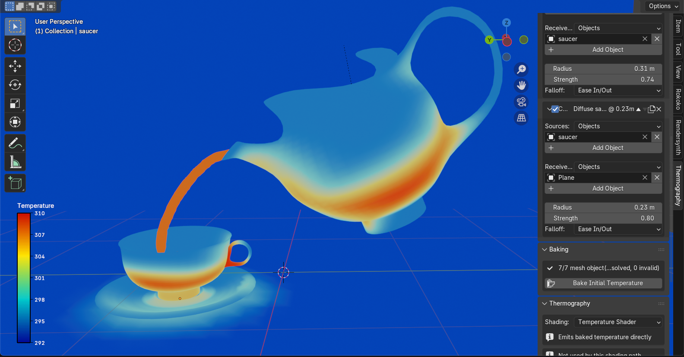

#   

IR-synth is a Blender add-on for generating synthetic thermal imagery. The goal is to make it easy to produce realistic, labeled infrared data without needing an actual thermal camera or a physical scene, which is useful for training and testing computer vision models that work with thermal images.

Blender already gives the user a full 3D pipeline with geometry, materials, cameras, and rendering aspects. IR-synth adds a way to simulate heat and radiation on top of that scene, so what comes out the other end looks like it was captured by a thermal sensor instead of a regular RGB camera.

## How it works

Generating a thermal image with IR-synth usually follows a simple procedure:

**1. Set an initial temperature field.** You start by defining the temperature distribution across your scene, either by hand (assigning values to objects or regions) or programmatically, driving it from a script, a heat simulation, or an external dataset.

**2. Set environment features (optional).** On top of the base temperature field, you can layer in things like emissivity per material or surface, ambient humidity, and ambient temperature. These affect how heat is emitted and perceived, and skipping them just falls back to simpler assumptions or default values depending on the rendering model, see below.

**3. Choose how radiance is emitted.** IR-synth gives you a choice of models for how the temperature field gets converted into emitted radiance, so you can trade off physical accuracy against speed depending on what you're doing.

**4. Render the thermography image.** Finally, the scene is rendered into a synthetic thermal image using one of the available renderers, giving you output that mimics what a real IR sensor would capture.

## Where this is headed

The project is meant to plug into a broader synthetic data ecosystem. There's an intention to integrate with [BlenderProc](https://github.com/DLR-RM/BlenderProc) and [RenderSynth](https://github.com/lorenzozanizz/rendersynth) down the line, so that thermal generation can enter into existing procedural rendering pipelines rather than staying isolated. This isn't fully implemented yet, just the direction things are heading.

## Getting started

Documentation and tutorials are being built out at the GitHub Pages [project site](https://lorenzozanizz.github.io/ir-synth). Expect some rough edges, and check the docs for the most current setup instructions rather than relying on this README to stay in sync.

## Contributing

This is a small project and contributions are obviously welcome. Whether it's a bug fix, a new emissivity model, a renderer backend, better docs, or just an idea for where this should go next feel free to open an issue or a pull request. If you're planning something bigger, opening an issue first to discuss it is a good way to make sure the work lines up with where the current project contributors are headed.

## Acknowledgments

The physical models and simulation approach draw on existing research in thermal simulation, heat transfer, and infrared rendering. The repository includes a `references.bib` file listing the papers and resources that informed this work, and it's worth checking if you want to understand the theory behind any particular piece of the pipeline. If you feel a source is missing or miscredited, please open an issue and we will gladly address it.

## Contact

Questions, feedback, or just want to talk about the project, send an email or open an issue
